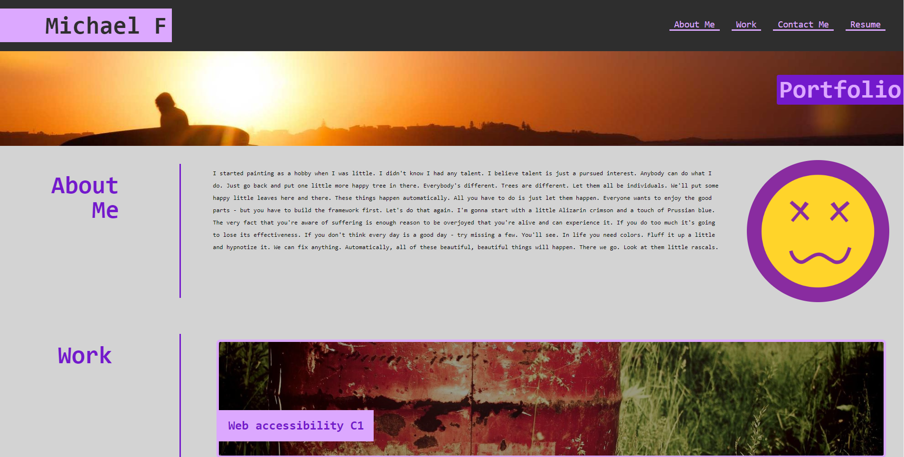
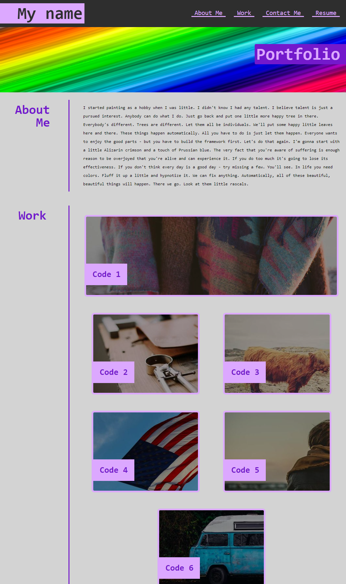
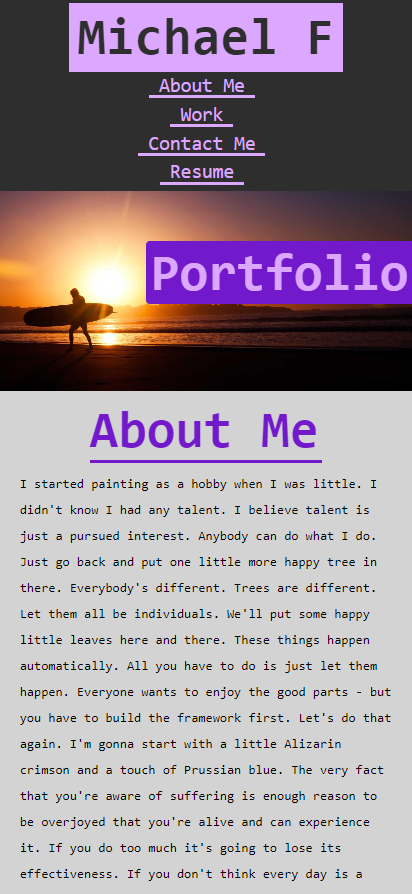

# Module-2-Challenge

## Description
This was a fun project. I assume we will use these skills and even some of this code to help build our own portfolios.
 
I struggled the most with different browsers creating vertical scroll when width is set less that 100%.

## Deployment Link 🔗
[Demo Portfolio](https://moonphase13.github.io/portfolio-demo-C2/) 
[Repo](https://github.com/moonphase13/portfolio-demo-C2)

## User Story 📘
* AS AN employer
* I WANT to view a potential employee's deployed portfolio of work samples
* SO THAT I can review samples of their work and assess whether they're a good candidate for an open position
  

## Acceptance Criteria ✅
* GIVEN I need to sample a potential employee's previous work
* WHEN I load their portfolio
* THEN I am presented with the developer's name, a recent photo or avatar, and links to sections about them, their work, and how to contact them
* WHEN I click one of the links in the navigation
* THEN the UI scrolls to the corresponding section
* WHEN I click on the link to the section about their work
* THEN the UI scrolls to a section with titled images of the developer's applications
* WHEN I am presented with the developer's first application
* THEN that application's image should be larger in size than the others
* WHEN I click on the images of the applications
* THEN I am taken to that deployed application
* WHEN I resize the page or view the site on various screens and devices
* THEN I am presented with a responsive layout that adapts to my viewport
   

## Demo Given

   

## Deploment Screen Horizontal

   

## Deployment Screen Vertical

   

## Deployment Screenshot Mobile

   

## Credits
I realised an easier way was to use picsum for beautiful Lorem Picsum photos!
 
I just couldn't figure how to change the pictures on refresh. (it only works sometimes)
  

## Licence 🔑
MIT © XMoonphaseX
